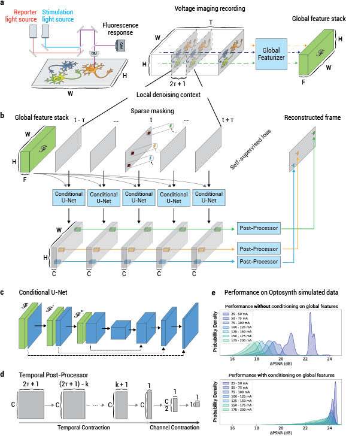

CellMincer
===========

CellMincer is a self-supervised machine learning framework for voltage imaging denoising models. A visual comparison of voltage imaging data before and after CellMincer is shown below:


An overview of voltage imaging data generation and CellMincer denoising model is shown below:



(a) A simplified schematic diagram of a typical optical voltage imaging experiment (left). The spatially resolved fluorescence response is recorded over time to produce a voltage imaging movie. A key component of CellMincer's preprocessing pipeline is the computation of spatial summary statistics and various auto-correlations from the entire recording, which are concatenated into a stack of global features (right). (b) An overview of CellMincer's deep learning architecture. (c) The conditional U-Net convolutional neural network (CNN). At each step in the contracting path, the precomputed global feature stack is spatially downsampled in parallel (:math:`\mathscr{F}\rightarrow \mathscr{F}'\rightarrow \mathscr{F}''`) and concatenated to the intermediate spatial feature maps. (d) The temporal post-processor neural network. The sequence of pixel embeddings are convolved with a 1D kernel along the time dimension, producing a single vector of length :math:`C`. A multilayer perceptron subsequently reduces this vector to a single value. (e) A comparison of model performance on simulated data before and after introducing global features as a U-Net conditioner. The distributions of PSNR gain are binned by stimulation amplitude. Using global features confers an average increase of 5 dB to the denoiser, roughly corresponding to a 3-fold noise reduction.

# Documentation and resources

Coming soon!

# Data availability

Raw and denoised voltage imaging datasets, as well as pretrained models and example configurations, can be found at this Google bucket: `gs://broad-dsp-cellmincer-data` (refer to [downloading from Google Cloud storage](https://cloud.google.com/storage/docs/uploads-downloads)).

# Preprint and citation
The bioRxiv preprint for CellMincer [can be found here](https://www.biorxiv.org/content/10.1101/2024.04.12.589298v1). The BibTeX citation:
```
@article {Wang2024.04.12.589298,
    author = {Brice Wang, Tianle Ma, Theresa Chen, Trinh Nguyen, Ethan Crouse, Stephen J Fleming, Alison S Walker, Vera Valakh, Ralda Nehme, Evan W Miller, Samouil L Farhi, and Mehrtash Babadi},
    title = {Robust self-supervised denoising of voltage imaging data using CellMincer},
    elocation-id = {2024.04.12.589298},
    year = {2024},
    doi = {10.1101/2024.04.12.589298},
    URL = {https://www.biorxiv.org/content/early/2024/04/15/2024.04.12.589298},
    eprint = {https://www.biorxiv.org/content/early/2024/04/15/2024.04.12.589298.full.pdf},
    journal = {bioRxiv}
}
```

# Related Github repositories

[CellMincerPaperAnalysis](https://github.com/cellarium-ai/CellMincerPaperAnalysis) contains notebooks for reproducing the analysis and figures in the preprint.

[Optosynth](https://github.com/cellarium-ai/Optosynth) is a voltage imaging simulation framework which generates synthetic data used to optimize and benchmark CellMincer.